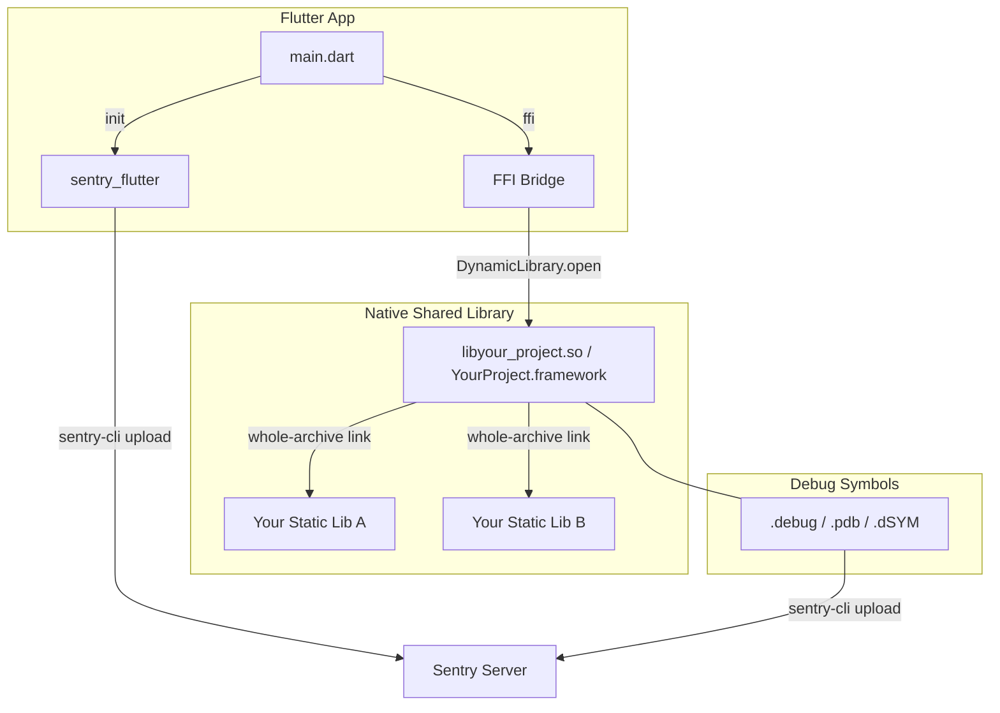

# Sentry Integration Guide for Flutter with Native FFI Libraries

This document describes how to integrate [Sentry](https://sentry.io) into a Flutter project that includes native C/C++ libraries loaded via **dart:ffi**, covering:

- Adding `sentry_flutter` to your Dart code
- Compiling native shared libraries with separate debug symbol files (`.debug`, `.pdb`, `.dSYM`)
- Linking multiple static libraries into one shared library for FFI
- Installing `sentry-cli` and uploading debug symbols for crash symbolication
- Automating symbol uploads in CI/CD

---

## Table of Contents

1. [Architecture Overview](#architecture-overview)
2. [Adding Sentry to Flutter](#adding-sentry-to-flutter)
3. [Compiling Native Libraries with Debug Symbols](#compiling-native-libraries-with-debug-symbols)
4. [Linking Static Libraries into a Shared Library for FFI](#linking-static-libraries-into-a-shared-library-for-ffi)
5. [Installing sentry-cli](#installing-sentry-cli)
6. [Uploading Debug Symbols to Sentry](#uploading-debug-symbols-to-sentry)
7. [CI/CD Integration (GitHub Actions)](#cicd-integration-github-actions)
8. [Verification Checklist](#verification-checklist)

---

## Architecture Overview



- **sentry_flutter** captures Dart-level crashes and errors.
- Native C/C++ crashes in the shared library are captured as minidumps by Sentry's native SDK.
- Debug symbol files are extracted at build time and uploaded separately to Sentry for symbolication.
- Static libraries are linked into the final shared library via `--whole-archive` so all FFI-callable symbols are preserved.

---

## Adding Sentry to Flutter

### 1. Add the dependency

In `pubspec.yaml`:

```yaml
dependencies:
  sentry_flutter: ^9.0.0
```

Run `flutter pub get`.

### 2. Initialize Sentry before `runApp`

Wrap your app entry point so Sentry captures all errors. A minimal setup in `lib/main.dart`:

```dart
import 'package:flutter/material.dart';
import 'package:sentry_flutter/sentry_flutter.dart';

Future<void> main() async {
  WidgetsFlutterBinding.ensureInitialized();

  await SentryFlutter.init(
    (options) {
      options.dsn = 'https://<key>@o<org>.ingest.us.sentry.io/<project>';
      options.tracesSampleRate = 1.0;        // 1.0 = all transactions
    },
    appRunner: () async {
      // Your normal app initialization here
      runApp(MyApp());
    },
  );
}
```

### 3. (Optional) Filter events with `beforeSend`

Use `beforeSend` to control which events reach Sentry — for example, only sending errors and fatals while skipping warnings:

```dart
options.beforeSend = (event, hint) async {
  final isErrorOrFatal = event.throwable != null ||
      event.level == SentryLevel.error ||
      event.level == SentryLevel.fatal;

  if (!isErrorOrFatal) {
    return null;  // drop the event
  }
  return event;
};
```

### 4. (Optional) Attaching files to crash reports

You can attach arbitrary files (logs, dumps, config files) to crash reports via `beforeSend` or when capturing a message manually. This is useful for attaching native SDK logs or diagnostic data:

```dart
import 'dart:io';
import 'package:path_provider/path_provider.dart';
import 'package:sentry_flutter/sentry_flutter.dart';

/// Attaches the given files to a Sentry event hint.
Future<void> attachFilesToHint(Hint hint, List<File> files) async {
  final alreadyAttached = hint.attachments.map((a) => a.filename).toSet();

  for (final file in files) {
    if (!await file.exists()) continue;
    final bytes = await file.readAsBytes();
    if (bytes.isEmpty) continue;  // skip empty — avoids malformed envelope headers

    final fileName = file.uri.pathSegments.isNotEmpty
        ? file.uri.pathSegments.last
        : 'attachment.bin';
    if (alreadyAttached.contains(fileName)) continue;

    hint.attachments.add(
      SentryAttachment.fromUint8List(
        bytes,
        fileName,
        contentType: 'text/plain',
      ),
    );
  }
}
```

Call this from your `beforeSend` callback:

```dart
options.beforeSend = (event, hint) async {
  final docsDir = await getApplicationDocumentsDirectory();
  await attachFilesToHint(hint, [
    File('${docsDir.path}/native_sdk.log'),
    File('${docsDir.path}/diagnostics.txt'),
  ]);
  return event;
};
```

You can also use `hint.attachments` when manually capturing events:

```dart
final hint = Hint();
await attachFilesToHint(hint, [File('/path/to/report.log')]);
await Sentry.captureMessage('Manual log submission', hint: hint);
```

> **Note:** Empty attachments produce malformed envelope item headers that Android's native SDK rejects. Always skip zero-byte files.

---

## Compiling Native Libraries with Debug Symbols

### The CMake Toggle

All debug symbol generation should be controlled by a single CMake option. Place this in your project's shared CMake configuration (e.g., `cmake/CommonBuildParameters.cmake`):

```cmake
option(ENABLE_RELEASE_SYMBOLS "Build Release with debug symbols for symbolication" ON)
```

Keep it **ON by default** so every Release build produces symbolication data.

### Compiler Flags by Compiler

```cmake
if(ENABLE_RELEASE_SYMBOLS AND CMAKE_CXX_COMPILER_ID MATCHES "^(AppleClang|Clang|GNU)$")
    add_compile_options(
        "$<$<CONFIG:Release>:-gline-tables-only>"
        "$<$<CONFIG:RelWithDebInfo>:-g>"
    )
endif()
```

| Build Type | Clang/GCC Flag | What It Does |
|---|---|---|
| **Release** | `-gline-tables-only` | Emits line number tables only — enough for stack unwinding and symbolication, minimal binary size impact |
| **RelWithDebInfo** | `-g` | Full debug information (variable names, types, etc.) |

For **MSVC** (Windows), the equivalent is set per-target with `/Zi` (compile) and `/DEBUG:FULL` (link).

### objcopy Tool Discovery

For Linux and Android, `objcopy` (or `llvm-objcopy`) is required to extract debug symbols into a separate file:

```cmake
if(ENABLE_RELEASE_SYMBOLS)
    if(CMAKE_OBJCOPY)
        set(PROJECT_OBJCOPY_EXECUTABLE "${CMAKE_OBJCOPY}")
    elseif(CMAKE_SYSTEM_NAME STREQUAL "Linux" OR CMAKE_SYSTEM_NAME STREQUAL "Android")
        find_program(PROJECT_OBJCOPY_EXECUTABLE NAMES llvm-objcopy objcopy REQUIRED)
    endif()
endif()
```

### Debug Symbol Extraction by Platform

> In all examples below, replace `your_target` with the actual CMake target name of your shared library.

#### Linux / Android — `.debug` files

Uses `objcopy` in a post-build step:

```cmake
add_custom_command(TARGET your_target POST_BUILD
    COMMAND ${CMAKE_COMMAND} -E chdir $<TARGET_FILE_DIR:your_target>
        ${PROJECT_OBJCOPY_EXECUTABLE} --only-keep-debug
        $<TARGET_FILE_NAME:your_target>
        $<TARGET_FILE_NAME:your_target>.debug
    COMMAND ${CMAKE_COMMAND} -E chdir $<TARGET_FILE_DIR:your_target>
        ${PROJECT_OBJCOPY_EXECUTABLE} --strip-debug
        --add-gnu-debuglink=$<TARGET_FILE_NAME:your_target>.debug
        $<TARGET_FILE_NAME:your_target>
    COMMENT "Generating detached debug symbols for your_target"
)
```

- `--only-keep-debug`: Extracts all debug info into a `.debug` file.
- `--strip-debug`: Removes debug info from the shipped binary (reduces size).
- `--add-gnu-debuglink`: Adds a reference in the binary pointing to the `.debug` file so debuggers can find it automatically.

Result: `libyour_target.so` (stripped) + `libyour_target.so.debug` (symbols).

#### macOS / iOS — `.dSYM` bundles

Uses Apple's `dsymutil`:

```cmake
if(APPLE AND ENABLE_RELEASE_SYMBOLS)
    find_program(DSYMUTIL_EXECUTABLE dsymutil REQUIRED)
    add_custom_command(TARGET your_target POST_BUILD
        COMMAND ${DSYMUTIL_EXECUTABLE} $<TARGET_FILE:your_target>
            -o $<TARGET_FILE:your_target>.dSYM
        COMMENT "Generating dSYM for your_target"
    )
    install(DIRECTORY $<TARGET_FILE:your_target>.dSYM
        DESTINATION ${CMAKE_INSTALL_LIBDIR}
        OPTIONAL
    )
endif()
```

Result: `YourTarget.framework.dSYM/` (a bundle containing DWARF debug info).

#### Windows — `.pdb` files

For MSVC targets, set compile and link flags on your shared library target:

```cmake
if(MSVC)
    target_compile_options(your_target PRIVATE
        "$<$<CONFIG:Release>:/Zi>"
        "$<$<CONFIG:RelWithDebInfo>:/Zi>"
    )
    target_link_options(your_target PRIVATE
        "$<$<CONFIG:Release>:/DEBUG:FULL>"
        "$<$<CONFIG:RelWithDebInfo>:/DEBUG:FULL>"
    )
    install(FILES $<TARGET_PDB_FILE:your_target>
        DESTINATION ${CMAKE_INSTALL_LIBDIR}
        OPTIONAL
    )
endif()
```

- `/Zi`: Produces a standalone `.pdb` file with full debug info.
- `/DEBUG:FULL`: Includes full debug information in the PDB.

Result: `your_target.pdb` alongside the `.dll`.

### Summary: Debug Symbol File Types

| Platform | Symbol Format | Extraction Tool | File Extension |
|---|---|---|---|
| **Android** | ELF DWARF | `llvm-objcopy` / `objcopy` | `.debug` |
| **Linux** | ELF DWARF | `llvm-objcopy` / `objcopy` | `.debug` |
| **iOS** | Mach-O DWARF | `dsymutil` | `.dSYM` (directory) |
| **macOS** | Mach-O DWARF | `dsymutil` | `.dSYM` (directory) |
| **Windows** | PDB (Program Database) | MSVC linker (`/DEBUG:FULL`) | `.pdb` |

---

## Linking Static Libraries into a Shared Library for FFI

A common pattern in Flutter projects with native code is:

1. You have one or more **static libraries** (`.a`) built from C/C++ code.
2. You want Flutter to call into them via **dart:ffi**.
3. `dart:ffi` can only open **shared libraries** (`.so`, `.dylib`, `.framework`, `.dll`).
4. So you create a single **shared library** that links all your static libs, and Flutter loads that.

### The Layer Cake

```
┌─────────────────────────────────────────────┐
│  Flutter App (Dart)                         │
│  loads your shared lib via dart:ffi         │
├─────────────────────────────────────────────┤
│  libyour_project.so / YourProject.framework │  ← final shared lib (SHARED)
│  (thin wrapper exposing FFI entry points)   │
├─────────────────────────────────────────────┤
│  libcore.a       ← whole-archive            │
│  libprocessing.a ← whole-archive            │
│  libcrypto.a     ← whole-archive            │
│  (your static libraries)                    │
├─────────────────────────────────────────────┤
│  Third-party static libs                    │
│  (boost, openssl, protobuf, etc.)           │
└─────────────────────────────────────────────┘
```

### CMake Configuration

```cmake
set(BUILD_SHARED_LIBS ON)

add_library(
    your_project          # <-- your shared library target name
    SHARED
    null.cpp              # placeholder; real symbols come from static libs
)

# Link static libs with whole-archive to force all symbols in
target_link_libraries(your_project PRIVATE
    -Wl,--whole-archive   # GCC/Clang
    libcore
    libprocessing
    -Wl,--no-whole-archive
)

# On Apple platforms the linker flag differs:
# target_link_libraries(your_project PRIVATE
#     -Wl,-force_load    path/to/libcore.a
#     -Wl,-force_load    path/to/libprocessing.a
# )

# On MSVC:
# target_link_options(your_project PRIVATE /WHOLEARCHIVE:libcore.lib)
```

> **`--whole-archive`** (Linux/Android), **`-force_load`** (Apple), or **`/WHOLEARCHIVE`** (MSVC) is critical: it forces the linker to include every object file from the static libraries, even if no symbol is directly referenced within the shared library's own code. Without this, dead-code elimination would strip functions that are only called via FFI.

### Loading the Shared Library at Runtime

The Dart side loads the library based on the platform:

```dart
import 'dart:ffi';
import 'dart:io';

DynamicLibrary loadNativeLibrary() {
  if (Platform.isAndroid) {
    return DynamicLibrary.open('libyour_project.so');
  } else if (Platform.isIOS) {
    return DynamicLibrary.open('YourProject.framework/YourProject');
  } else if (Platform.isMacOS) {
    return DynamicLibrary.open('YourProject.framework/YourProject');
  }
  // Windows/Linux: linked into the Flutter executable
  return DynamicLibrary.executable();
}
```

### Generating FFI Bindings with `ffigen`

For non-trivial native APIs, hand-writing `lookupFunction` calls for every C function is tedious and error-prone. The [`ffigen`](https://pub.dev/packages/ffigen) package auto-generates type-safe Dart bindings from your C header files.

#### 1. Add the dev dependency

In `pubspec.yaml`:

```yaml
dev_dependencies:
  ffigen: ^19.0.0
```

#### 2. Create a config file

Create a YAML config (e.g., `ffigen.yaml`) pointing to your C headers and specifying the output file:

```yaml
# ffigen.yaml
output: "lib/ffi/native_bindings.dart"
name: "NativeBindings"
description: "FFI bindings for my native library."
headers:
  entry-points:
    - "../path/to/your_library.h"
    - "../path/to/another_header.h"
compiler-opts:
  # Include paths for transitive headers
  - "-I../path/to/include"
```

| Key | Purpose |
|---|---|
| `output` | Path to the generated `.dart` file |
| `name` | Name of the generated top-level class |
| `headers.entry-points` | List of C header files to parse |
| `compiler-opts` | Extra flags passed to the C parser (include paths, defines, etc.) |

> **Tip:** If your header includes transitive dependencies, add their include directories via `compiler-opts` so `ffigen` can resolve all types.

#### 3. Run code generation

```bash
dart run ffigen --config ffigen.yaml
```

Or with `flutter`:

```bash
flutter pub run ffigen --config ffigen.yaml
```

Run this after any change to your native C API (new functions, changed signatures, etc.).

#### 4. What gets generated

`ffigen` produces a `NativeBindings` class where each C function becomes a typed Dart method. The raw `lookupFunction` call is generated once and cached:

```dart
// AUTO GENERATED FILE, DO NOT EDIT.
// Generated by `package:ffigen`.
import 'dart:ffi' as ffi;

class NativeBindings {
  final ffi.Pointer<T> Function<T extends ffi.NativeType>(String symbolName)
      _lookup;

  NativeBindings(ffi.DynamicLibrary dynamicLibrary)
      : _lookup = dynamicLibrary.lookup;

  NativeBindings.fromLookup(
      ffi.Pointer<T> Function<T extends ffi.NativeType>(String symbolName)
          lookup)
      : _lookup = lookup;

  /// C function: const char* my_init(const char* config_path, int port);
  ffi.Pointer<ffi.Char> myInit(
    ffi.Pointer<ffi.Char> configPath,
    int port,
  ) {
    return _myInit(configPath, port);
  }

  late final _myInitPtr = _lookup<
      ffi.NativeFunction<
          ffi.Pointer<ffi.Char> Function(
              ffi.Pointer<ffi.Char>, ffi.Int32)>>('my_init');
  late final _myInit = _myInitPtr.asFunction<
      ffi.Pointer<ffi.Char> Function(ffi.Pointer<ffi.Char>, int)>();
}
```

#### 5. Use the generated bindings

Wire the generated class together with your runtime library loading:

```dart
final library = loadNativeLibrary();
final bindings = NativeBindings(library);

// Call native functions with full type safety
final result = bindings.myInit(configPath.cast(), 8080);
```

#### Summary: manual vs. ffigen

| Approach | Best For |
|---|---|
| **Manual `lookupFunction`** | 1–3 simple functions, quick prototyping |
| **`ffigen` code generation** | Non-trivial APIs with many functions, structs, enums, or callbacks |

The generated file should be committed to version control so that builds don't require `ffigen` at compile time. Add a CI check or pre-commit hook to ensure regenerated bindings match the current headers.

### Per-Platform CMake Entry Points

Each platform's Flutter build has its own CMakeLists.txt. They all include a shared CMake module that defines the library target and debug symbol rules:

| Platform | Typical CMakeLists.txt Location | Output |
|---|---|---|
| **Android** | `android/app/CMakeLists.txt` | `libyour_project.so` |
| **iOS** | `ios/native/CMakeLists.txt` | `YourProject.framework` |
| **macOS** | `macos/native/CMakeLists.txt` | `YourProject.framework` |
| **Windows** | `windows/CMakeLists.txt` | Linked into Flutter executable |
| **Linux** | `linux/CMakeLists.txt` | Linked into Flutter executable |

### Building

```bash
# Android (release with debug symbols)
CMAKE_ARGUMENTS="-DCMAKE_BUILD_TYPE=Release" flutter build apk --release

# iOS
CMAKE_ARGUMENTS="-DCMAKE_BUILD_TYPE=Release" flutter build ios --release

# macOS
CMAKE_ARGUMENTS="-DCMAKE_BUILD_TYPE=Release" flutter build macos --release

# Windows (PowerShell)
$env:CMAKE_ARGUMENTS="-DCMAKE_BUILD_TYPE=Release"
flutter build windows --release

# Linux
CMAKE_ARGUMENTS="-DCMAKE_BUILD_TYPE=Release" flutter build linux --release
```

After building, debug symbols will be alongside the binary:

- **Android**: `build/app/intermediates/.../*.so` and `build/**/*.debug`
- **iOS**: `build/ios/**/*.dSYM` and `ios/native/build/**/*.dSYM`
- **macOS**: `build/macos/**/*.dSYM` and `build/macos/**/*.debug`
- **Linux**: `build/linux/**/*.debug` and `build/linux/<binary_name>`
- **Windows**: `build/windows/**/*.pdb`, `*.dll`, `*.exe`

---

## Installing sentry-cli

`sentry-cli` is the official command-line tool for uploading debug symbols, managing releases, and more.

### Linux

```bash
curl -sL https://sentry.io/get-cli/ | sh
```

The binary is installed to `~/.local/bin/sentry-cli`. Add it to your PATH if needed:

```bash
echo 'export PATH="$HOME/.local/bin:$PATH"' >> ~/.bashrc
```

### macOS (Homebrew)

```bash
brew install getsentry/tools/sentry-cli
```

### Windows (winget)

```powershell
winget install --exact --id Sentry.sentry-cli --silent --accept-source-agreements --accept-package-agreements
```

If `sentry.exe` is not on your PATH after installation, locate it manually:

```powershell
# Find the install directory
Get-ChildItem "$env:LOCALAPPDATA\Microsoft\WinGet\Packages" -Directory -Filter "Sentry.sentry-cli*" |
    ForEach-Object {
        Get-ChildItem $_.FullName -Recurse -Filter "sentry.exe" -File
    }
```

Then add that directory to your `PATH` environment variable.

> **Binary name varies by platform.** The executable may be named `sentry-cli` (Linux/macOS) or `sentry` / `sentry.exe` (Windows). In scripts, try all variants:
>
> ```bash
> if command -v sentry-cli >/dev/null 2>&1; then
>     SENTRY_CMD="sentry-cli"
> elif command -v sentry >/dev/null 2>&1; then
>     SENTRY_CMD="sentry"
> elif command -v sentry.exe >/dev/null 2>&1; then
>     SENTRY_CMD="sentry.exe"
> fi
> ```

### Verify Installation

```bash
sentry-cli --version
```

### Authentication

First-time setup requires authentication:

```bash
sentry-cli login
```

Or set environment variables (recommended for CI):

```bash
export SENTRY_AUTH_TOKEN=<your-auth-token>
export SENTRY_ORG=<your-org-slug>
export SENTRY_PROJECT=<your-project-slug>
```

> Generate an auth token at: **Sentry → Settings → Account → API → Auth Tokens** with `project:write` scope.

---

## Uploading Debug Symbols to Sentry

### Upload Command

```bash
sentry-cli debug-files upload \
    --org "$SENTRY_ORG" \
    --project "$SENTRY_PROJECT" \
    --include-sources \
    <path-to-symbols>...
```

- `--include-sources`: Uploads source files referenced by debug info, enabling source context in Sentry stack traces (showing the exact line of code that crashed).
- You can pass multiple paths: directories, individual files, or glob patterns.
- Sentry deduplicates by build ID — re-uploading the same symbols is a no-op.

### Platform-Specific Symbol Discovery

#### Android

```bash
# Upload .so files and .debug symbol files
find build/app -type f -name "*.so" -exec sentry-cli debug-files upload \
    --org "$SENTRY_ORG" --project "$SENTRY_PROJECT" --include-sources {} +
find build -type f -name "*.debug" -exec sentry-cli debug-files upload \
    --org "$SENTRY_ORG" --project "$SENTRY_PROJECT" --include-sources {} +
```

#### iOS

```bash
# dSYM bundles are directories
find build/ios -type d -name "*.dSYM" -exec sentry-cli debug-files upload \
    --org "$SENTRY_ORG" --project "$SENTRY_PROJECT" --include-sources {} +
find ios/native/build -type d -name "*.dSYM" -exec sentry-cli debug-files upload \
    --org "$SENTRY_ORG" --project "$SENTRY_PROJECT" --include-sources {} +
```

#### macOS

```bash
find build/macos -type d -name "*.dSYM" -exec sentry-cli debug-files upload \
    --org "$SENTRY_ORG" --project "$SENTRY_PROJECT" --include-sources {} +
find macos/native/build -type d -name "*.dSYM" -exec sentry-cli debug-files upload \
    --org "$SENTRY_ORG" --project "$SENTRY_PROJECT" --include-sources {} +
find build/macos -type f -name "*.debug" -exec sentry-cli debug-files upload \
    --org "$SENTRY_ORG" --project "$SENTRY_PROJECT" --include-sources {} +
```

#### Linux

```bash
find build/linux -type f -name "*.debug" -exec sentry-cli debug-files upload \
    --org "$SENTRY_ORG" --project "$SENTRY_PROJECT" --include-sources {} +
# Also upload the main binary (it has .gnu_debuglink pointing to .debug files)
sentry-cli debug-files upload \
    --org "$SENTRY_ORG" --project "$SENTRY_PROJECT" --include-sources \
    build/linux/<binary_name>
```

#### Windows

```powershell
Get-ChildItem build/windows -Recurse -Filter "*.pdb" | ForEach-Object {
    sentry-cli debug-files upload --org $env:SENTRY_ORG --project $env:SENTRY_PROJECT --include-sources $_.FullName
}
Get-ChildItem build/windows -Recurse -Filter "*.dll" | ForEach-Object {
    sentry-cli debug-files upload --org $env:SENTRY_ORG --project $env:SENTRY_PROJECT --include-sources $_.FullName
}
Get-ChildItem build/windows -Recurse -Filter "*.exe" | ForEach-Object {
    sentry-cli debug-files upload --org $env:SENTRY_ORG --project $env:SENTRY_PROJECT --include-sources $_.FullName
}
```

### When to Upload

Upload debug symbols **for every Release build** you distribute.

- Upload on merges to `main` / `develop`.
- Upload on tagged releases.
- Do **not** upload debug-only or local development builds (wasteful).

---

## CI/CD Integration (GitHub Actions)

### 1. Install sentry-cli

```yaml
- name: Install Sentry CLI (Linux)
  if: runner.os == 'Linux'
  run: |
    if ! command -v sentry-cli >/dev/null 2>&1; then
      curl -sL https://sentry.io/get-cli/ | sh
    fi
    echo "$HOME/.local/bin" >> "$GITHUB_PATH"

- name: Install Sentry CLI (macOS)
  if: runner.os == 'macOS'
  run: brew install getsentry/tools/sentry-cli

- name: Install Sentry CLI (Windows)
  if: runner.os == 'Windows'
  run: |
    winget install --exact --id Sentry.sentry-cli --silent \
      --accept-source-agreements --accept-package-agreements
```

### 2. Upload Symbols

```yaml
- name: Upload debug symbols to Sentry
  if: github.ref_name == 'main' || github.ref_name == 'develop' || startsWith(github.ref, 'refs/tags/')
  env:
    SENTRY_AUTH_TOKEN: ${{ secrets.SENTRY_AUTH_TOKEN }}
    SENTRY_ORG: ${{ secrets.SENTRY_ORG }}
    SENTRY_PROJECT: ${{ secrets.SENTRY_PROJECT }}
  run: |
    set -euo pipefail

    # Skip if secrets not configured
    if [ -z "${SENTRY_AUTH_TOKEN:-}" ] || [ -z "${SENTRY_ORG:-}" ] || [ -z "${SENTRY_PROJECT:-}" ]; then
      echo "Sentry secrets are not fully configured; skipping."
      exit 0
    fi

    # Auto-detect sentry-cli binary name
    SENTRY_CMD=""
    if command -v sentry-cli >/dev/null 2>&1; then SENTRY_CMD="sentry-cli"
    elif command -v sentry >/dev/null 2>&1; then SENTRY_CMD="sentry"
    elif command -v sentry.exe >/dev/null 2>&1; then SENTRY_CMD="sentry.exe"
    else echo "Sentry CLI not found."; exit 1
    fi

    # Collect symbol paths (platform-specific)
    declare -a SYMBOLS=()

    add_files() {
      local root="$1"; local pattern="$2"
      if [ -d "$root" ]; then
        while IFS= read -r path; do SYMBOLS+=("$path"); done < <(find "$root" -type f -name "$pattern" 2>/dev/null)
      fi
    }

    add_dirs() {
      local root="$1"; local pattern="$2"
      if [ -d "$root" ]; then
        while IFS= read -r path; do SYMBOLS+=("$path"); done < <(find "$root" -type d -name "$pattern" 2>/dev/null)
      fi
    }

    case "${{ matrix.target }}" in
      "Android")
        add_files "build/app" "*.so"
        add_files "build" "*.debug"
        ;;
      "iOS")
        add_dirs "build/ios" "*.dSYM"
        add_dirs "ios/native/build" "*.dSYM"
        ;;
      "macOS")
        add_dirs "build/macos" "*.dSYM"
        add_dirs "macos/native/build" "*.dSYM"
        add_files "build/macos" "*.debug"
        ;;
      "Linux")
        add_files "build/linux" "*.debug"
        add_files "build/linux" "*"   # grab the binary too
        ;;
      "Windows")
        add_files "build/windows" "*.pdb"
        add_files "build/windows" "*.dll"
        add_files "build/windows" "*.exe"
        ;;
    esac

    if [ ${#SYMBOLS[@]} -eq 0 ]; then
      echo "No debug symbol files found."
      exit 0
    fi

    echo "Uploading ${#SYMBOLS[@]} symbol path(s) to Sentry..."
    "$SENTRY_CMD" debug-files upload \
      --org "$SENTRY_ORG" \
      --project "$SENTRY_PROJECT" \
      --include-sources \
      "${SYMBOLS[@]}"
```

### Required GitHub Secrets

| Secret | Description |
|---|---|
| `SENTRY_AUTH_TOKEN` | Sentry API auth token with `project:write` scope |
| `SENTRY_ORG` | Your Sentry organization slug (e.g., `my-company`) |
| `SENTRY_PROJECT` | Your Sentry project slug (e.g., `my-flutter-app`) |

Set these in: **GitHub → Settings → Secrets and variables → Actions → New repository secret**.

---

## Verification Checklist

- [ ] **Dart crashes are reported**: Trigger a Dart exception (e.g., `throw Exception("test")`) and confirm it appears in Sentry.
- [ ] **Native crashes are reported**: Trigger a native crash (e.g., null pointer dereference) and confirm a native event appears in Sentry.
- [ ] **Debug symbols are generated**: After a Release build, verify:
  - Android: `find build -name "*.debug"` returns files
  - iOS/macOS: `find build -name "*.dSYM"` returns directories
  - Windows: `find build -name "*.pdb"` returns files
- [ ] **Symbol upload succeeds**: Run the upload command manually or check CI logs for "Uploading N symbol path(s) to Sentry".
- [ ] **Native stack traces are symbolicated**: After a native crash, the Sentry issue should show readable function names and line numbers (not just memory addresses).
- [ ] **Source context is available**: With `--include-sources`, stack traces in Sentry should show the actual source code lines.
- [ ] **CI pipeline uploads on main/develop/tag**: Confirm the upload step runs on the correct branches and exits gracefully when secrets are missing.

---

## References

- [Sentry Flutter SDK Docs](https://docs.sentry.io/platforms/flutter/)
- [Sentry Native SDK Docs](https://docs.sentry.io/platforms/native/)
- [Sentry CLI Docs](https://docs.sentry.io/cli/)
- [sentry-cli debug-files upload](https://docs.sentry.io/cli/dif/#uploading-files)
- [Dart FFI Documentation](https://dart.dev/interop/c-interop)
